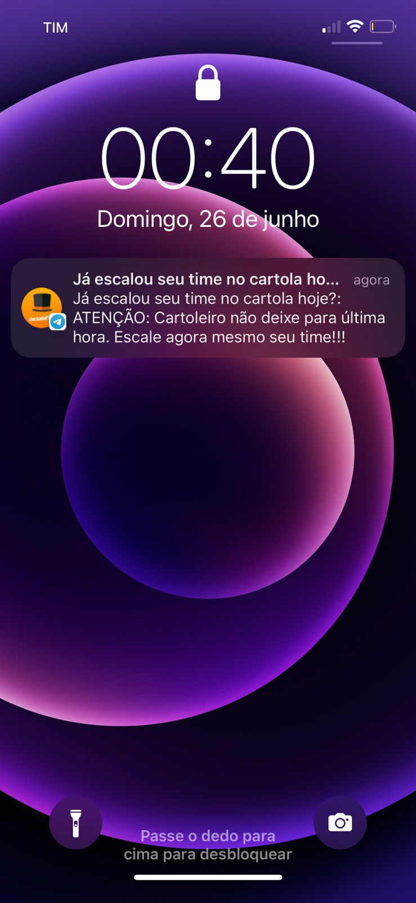

# :copyright: E aí, cartoleiro, já escalou seu time no Cartola hoje?


Não deixa para última hora! ~~como eu~~

[Entre aqui](https://t.me/+n8f3TlxXJ04wMThh) no grupo do Telegram agora mesmo ;)

<p align="center">
  <a></a>
</p>

<p align="center">
  <a></a>
</p>

<p align="center">
  <a></a>
</p>

## O que é o Cartola?

O Cartola é um fantasy game desenvolvido e mantido pela Globo. É um jogo "fictício" em que as pessoas montam seus times com jogadores de futebol da vida real. Você escala seu time a cada rodada e a sua pontuação é gerada de acordo com o rendimento e performance de cada atleta em campo.

Depois de escalado é só torcer para seus atletas mitarem na rodada.

## Objetivo

Este projeto é um BOT: Basicamente ele verifica quanto tempo falta para o mercado fechar (eu busco essa informação de uma API pública no Cartola) e, dependendo do período, o bot envia uma mensagem para um canal do TELEGRAM como um lembrete.

NUNCA MAIS esqueça de escalar seu time no cartola (a não ser que você continue procrastinando depois de 90985948594859494 mil avisos rsss)

## Motivação

Este projeto surgiu de uma necessidade pessoal: mesmo recebendo e-mail para escalar meu time na rodada, eventualmente eu acabo esquecendo.

A ideia é o BOT me lembrar e não mais esquecer de escalar meu time no Cartola.

## Regras de envio do lembrete

- Enviar lembretes apenas se o mercado estiver aberto; e
- Períodos de envio:
    - 48 horas antes do fechamento;
    - 24 horas antes do fechamento;
    - 12 horas antes do fechamento;
    - 6 horas antes do fechamento;
    - 3 horas antes do fechamento;
    - 1 horas antes do fechamento;
    - 45 minutos antes do fechamento;
    - 30 minutos antes do fechamento; e
    - 15 minutos antes do fechamento;

## 🛠️ Stack

- NodeJS: `v16.15.0`
- npm: `8.5.5`
- Jest para os testes de unidade e integração (100% of coverage): `^28.1.1`
- API Cartola
- Integração com Telegram
- crontab (Linux)

## Run

Antes de rodar o project, você deve:

- Criar seu bot no telegram;
- Criar um grupo no telegram;
- Nas configurações do grupo criado, você deve associá-lo ao Bot;
- Pegar um valor chamado `chat_id` do grupo criado;

E, por fim, você deve:

- Criar um arquivo chamado `.env` com base no `.env.example`; e
- Preencha as variáveis ​​de ambiente com as suas credenciais do telegram;

E finalmente, execute:

```
    npm install
    npm start
```

## Run test

```
    npm run test
    npm run test:coverage
```

## Crontab (agendamento)

Devido a série de configurações e execuções de comandos, deixei a documentação deste assunto em um README.md separado. 

- [Configuração Crontab](./docs/crontab.md)

## Variáveis de ambiente

Ao adicionar seu script para rodar via `crontab`, é necessário deixar as variáveis do arquivo `.env` acessíveis globamente. Para mais informações, leia o conteúdo a seguir:

- [Variáveis de ambiente](./docs/enviroment-variables.md)

## Links de referência:

- [Telegram BOT API](https://core.telegram.org/bots/api)
- [Telegram BOT API: Available methods](https://core.telegram.org/bots/api#available-methods)
- [Get Telegram Chat ID](https://sean-bradley.medium.com/get-telegram-chat-id-80b575520659)
- [How to obtain the Chat ID](https://stackoverflow.com/questions/33858927/how-to-obtain-the-chat-id-of-a-private-telegram-channel)
- [Making a Telegram BOT](https://www.sohamkamani.com/blog/2016/09/21/making-a-telegram-bot/#:~:text=Go%20to%20the%20telegram%20app%20on%20your%20phone%20and%E2%80%A6&text=Click%20on%20or%20type%20%2Fnewbot,to%20be%20a%20unique%20name.)
- [How to mock axios requests in jest](https://vhudyma-blog.eu/3-ways-to-mock-axios-in-jest/)
- [Crontab Generator](https://crontab.guru/)
- [How to run Cron jobs Every 5, 10 or 15 minutes](https://linuxize.com/post/cron-jobs-every-5-10-15-minutes/)

## 👩 Author

| [<br /><sub><b>@laisfrigerio</b></sub>](https://github.com/laisfrigerio)<br /> |
| :---: |

## 📄 License

This project is licensed under the MIT License - see the LICENSE.md file for details